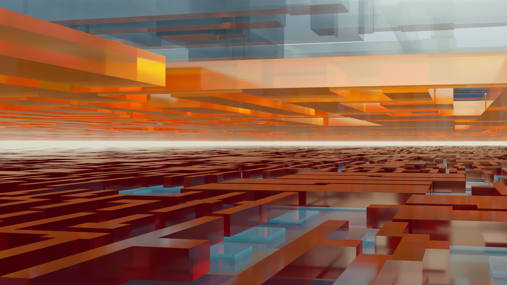

# Description

This version of gdsiistl.py is adapted to convert GDSII files generated by OpenLane tools for the SkyWater SKY130A PDK. Updates have been applied for compatibility with the Blender 3.1 Cycle rendering engine.

A 'gds layer' is a tuple of the `layer` and `datatype` attributes. Default values for SKY130A layers may be replaced by an external JSON configuration. Reference for [SKY130 GDS layer/datatype](https://skywater-pdk.readthedocs.io/en/main/rules/layers).

The script will default to the example `./gds/sample.gds` if a specific file is not provided on the command line. A fully qulified path name is required for the gds file if not running from the local folder.

## Implementation

1. Enumerate valid layers as (layer, datatype) tuples
2. Remove `paths` and `text` elements that are not used in the 3D mesh
3. Remove `polygons` from un-selected layers
4. Flatten the `top_level` cell hierarchy and remove library cells
5. Merge overlapping polygons
6. Convert polygons to triangle mesh
7. Extrude each triangle and export STL file
8. Repeat for each layer

## Testing

This script was tested on Windows 11 using Visual Studfio Code, pipenv and 32 GB of available RAM.

## Perfomance

A 3 MB gds file is converted to stl files in less than one minute. A 300 MB gds file may require several hours and 10 GB of RAM. Tests indicate an upper processing limit of 1.5 million polygons per layer.

## Portfolio

The video [GDS renders with Blender](https://www.youtube.com/watch?v=gBjQI3GrBHU) is recommended. The special note (26:45) to extend both the camera *and* viewport depth is important if clipping is observed.

*Drifting under the TiN (2023)*



***

*Original gdsiistl README file:*

# gdsiistl

Converts GDSII files to STL files.

GDSII files are often large, complex 2D designs for integrated circuits and MEMS chips. 3D visualization of the designs can be very useful, but this is tricky due to the complexity of the files. This is a simple script that extrudes selected layers of the GDSII files into 3D and outputs them as separate 3D STL files for visualization in an external program.

## Installation

Install git and Python 3 and its package manager (`pip`), then install:

```
pip install numpy
pip install gdspy
pip install numpy-stl
pip install triangle
```

The modules `gdspy` and `triangle` compile C libraries, which may cause trouble on Windows; it might require you to first install Microsoft Visual C++ Build Tools (e.g., from <https://visualstudio.microsoft.com/downloads>).

Finally:

For Blender 3.x

For Blender 2.x
```
git clone https://github.com/WallieEverest/gdsiistl
```

```
git clone https://github.com/mbalestrini/gdsiistl
```

## Usage

Suppose you have a GDSII file called `file.gds` that is to be converted to a 3D STL format.

First, choose GDSII layers to export and their thicknesses by editing `gdsiistl.py`, specifically, by entering the desired GDSII layer numbers and z bounds in the `layerstack` variable around line 35.

Second, run `python3 gdsiistl.py file.gds`. The file will be processed and output files written to `file.gds_layername1.stl`, `file.gds_layername2.stl`, etc.

Concretely:

```
cd gdsiistl
python gdsiistl.py {path}/example.gds
# output files are /stl/{layername}.stl, etc.
```

Many programs are capable of viewing the output STL files. Blender (<https://www.blender.org/>) can import STL files, apply materials, and render very impressive visualizations.

## Note

Due to a limitation of the library used to triangulate the polygonal boundaries of the GDSII geometry, the polygon borders (i.e., all geometry) are shifted slightly (by a hardcoded delta of about 0.01 units, or 10 nanometers in standard micron units) before export. Furthermore, due to another related limitation/bug (not yet completely understood; see source code comments), extra triangles are sometimes created covering holes in polygons.

So the output mesh is not guaranteed to be watertight, perfectly dimensioned, or retain all polygon holes, but it should be arbitrarily close and err on the side of extra triangles, so a program (e.g., Blender) can edit the mesh by deleting faces and produce a negligibly-far-from perfect visualization.
